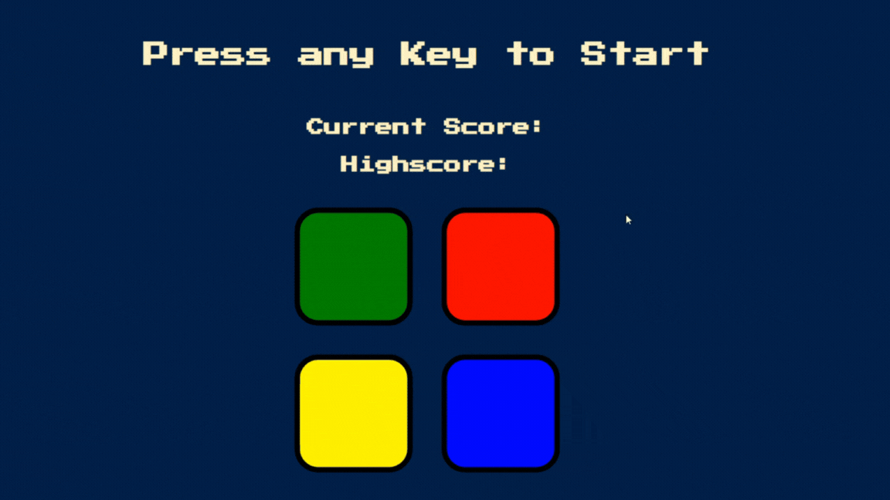
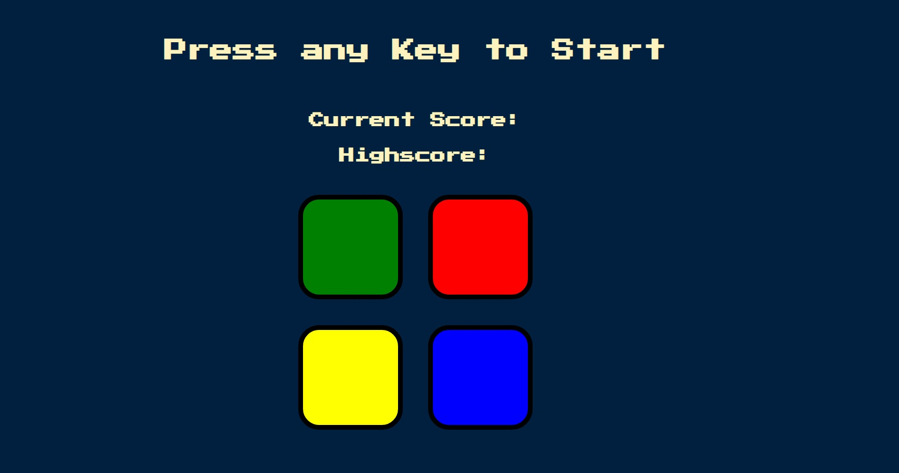

# Simon Game

## Table of Contents

- [Description](#description)
- [Features](#features)
- [Technologies Used](#technologies-used)
-  [Demo](#demo)
-  [Screenshot](#screenshot)
- [How to Play](#how-to-play)

## Description

Simon Game is a classic memory game where players need to remember and repeat a sequence of colors. This project is a web-based implementation of the Simon game using HTML, CSS, JavaScript, and jQuery.

## Features

- Interactive and responsive design.
- Auditory and visual cues for a more engaging experience.
- Keeps track of the current score and high score.
- Progressive difficulty as players advance through levels.

## Technologies Used

- HTML
- CSS
- JavaScript
- jQuery

## Demo

You can view a live demo of the Simon Game [here](https://simon-game-ashy-three.vercel.app/)

## Screenshot

## How to Play

1. Press any key to start the game.
2. Observe the sequence of colors presented by the game.
3. Click or press the corresponding colored buttons to repeat the sequence.
4. The game will progressively increase in difficulty with each successful sequence repetition.
5. If you make a mistake, the game will provide feedback, and your high score will be updated.
6. Try to beat your high score by remembering longer sequences.

## Enjoy playing the game!!
